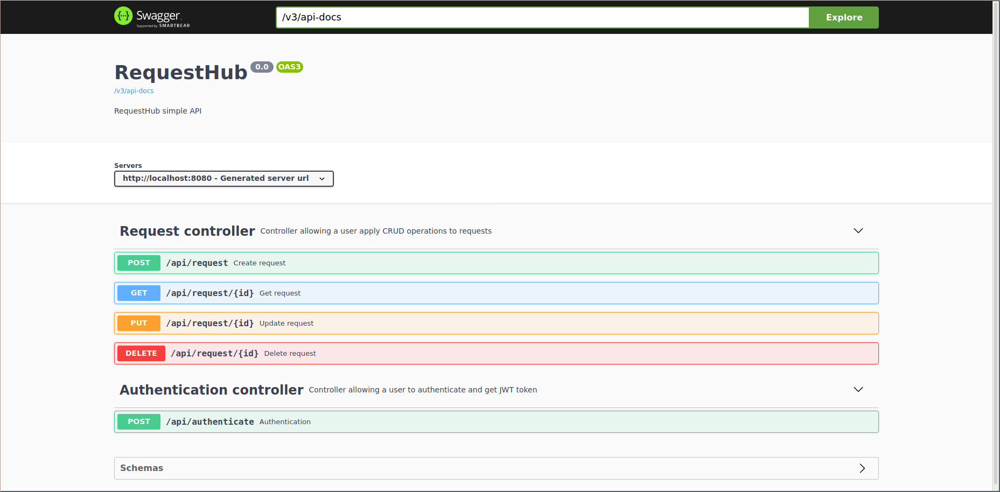

# Request Hub
Simple Spring REST API application based on JWT authentication.

### Installation
___
To install and run, everything you need is **git**, 
**docker** and **docker compose** installed on your system.

Just type:
```shell script
git clone https://github.com/pribavkindenis/request-hub.git
cd ./request-hub
```
And then:
- On **Linux** system, type ```make prod```
- On every other system, type ```docker-compose -f docker-compose.yml -f docker-compose.prod.yml up```

After that everything you need is go into your web browser and open the link below:
 
### [SwaggerUI address](http://localhost:8080/swagger-ui.html)
___


### Authentication
___
To authenticate perform **POST** http request in Authentication controller.

Default users are **admin:admin** and **samsepi0l:MrRobot**.

If everything is OK, your JWT token will be written in **token** cookie.

After that (and before your JWT expires) you can perform any other request in Request controller.

### CleanUp
___
After you have stopped containers you can run:
 
 ```make down-prod``` to remove stopped containers and networks
 
 
 ```make rm-prod``` to also remove named volumes
